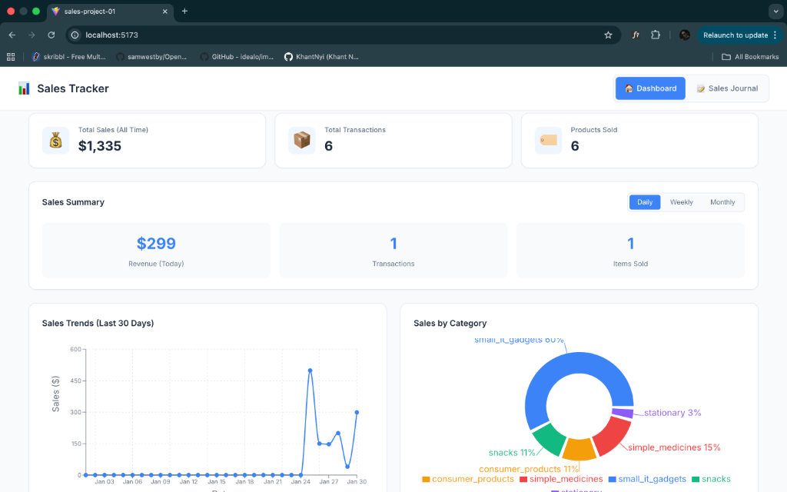
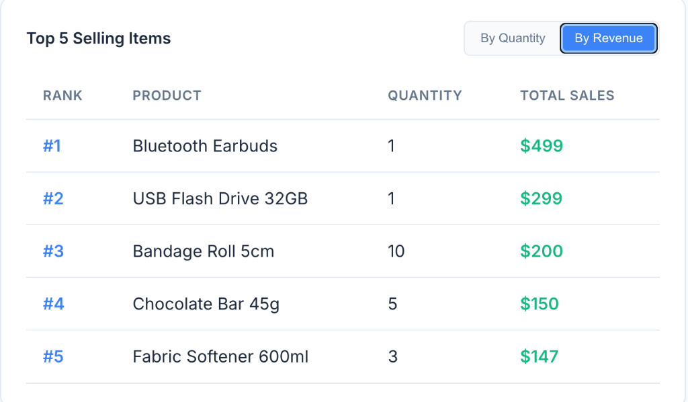
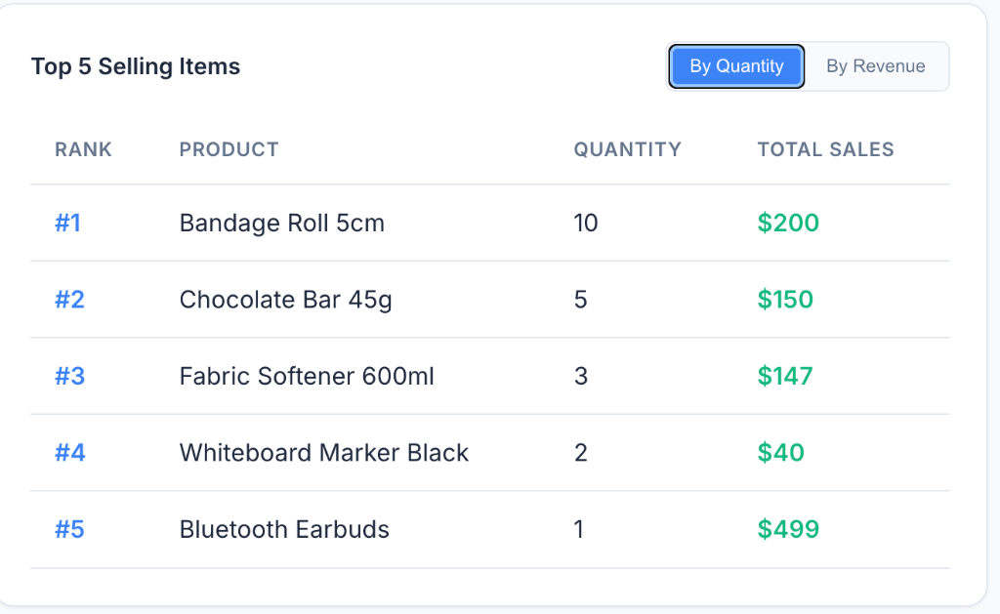
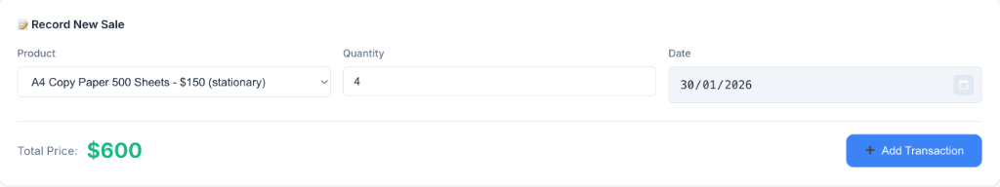
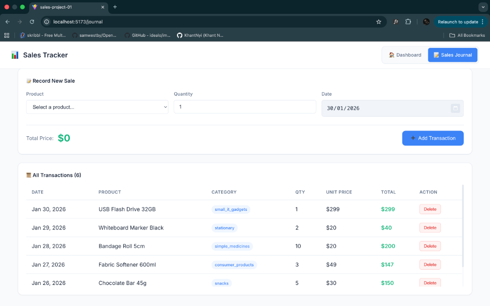

# Sales Tracker Application

## Team Members
- **Khant Nyi Thu** (ID: 6632108)
- **Paing Min Thant** (ID: 6622055)

---

## Project Overview

A comprehensive Sales Tracker application built with React and Vite, designed to specialized product sales tracking and analysis. The application features a clean, modern UI for managing sales transactions and visualizing performance metrics.

## Features

### 📊 Dashboard
- **Real-time Statistics**: Overview of Total Sales, Transaction Count, and Products Sold.
- **Sales Summary**: Toggleable Daily, Weekly, and Monthly performance views.
- **Visual Analytics**: Interactive Line Chart for sales trends (Last 30 Days) and Pie Chart for category distribution.
- **Top Performing Items**: Customizable "Top 5 Selling Items" table, sortable by either **Quantity Sold** or **Total Revenue**.

### 📝 Sales Journal
- **Transaction Recording**: User-friendly form to record new sales with automatic price calculation.
- **Product Management**: Integrated with a comprehensive product database (`pos_item.json`) including Stationary, IT Gadgets, Snacks, and more.
- **History & Management**: Complete history of transactions with the ability to delete entries.
- **Data Persistence**: All transactions are saved locally, ensuring date is retained across sessions.

## Screenshots

### Dashboard Overview
Comprehensive view of business performance with key metrics and detailed charts.


### Sales Summary & Analysis
Interactive charts and period-based summary cards.


### Top 5 Items Analysis
Sort by **Quantity** to see volume movers, or by **Revenue** to see high-value earners.

| Sorted by Quantity | Sorted by Revenue |
|:---:|:---:|
|  |  |

### Sales Journal
Record transactions easily with the streamlined form interface.


### Transaction History
View and manage all recorded sales in a clean, paginated list.


## Getting Started

1.  **Install Dependencies**:
    ```bash
    npm install
    ```
2.  **Run Development Server**:
    ```bash
    npm run dev
    ```
3.  **Build for Production**:
    ```bash
    npm run build
    ```

## Technologies Used
- **React** (Vite)
- **Recharts** for data visualization
- **date-fns** for date manipulation
- **CSS3** (Custom properties & Flexbox/Grid)
- **LocalStorage API** for data persistence
